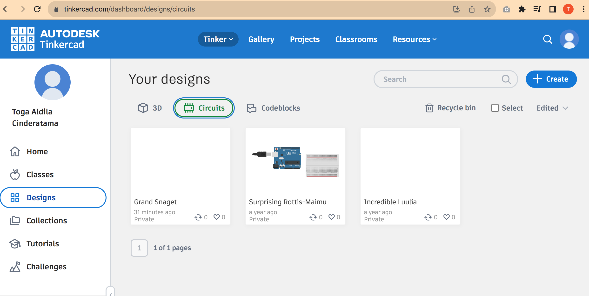

# Pertemuan ke 8 : Praktik Dasar Elektronika

## Topik Bahasan
Melakukan praktik dasar elektronika menggunakan beberapa tools seperti tinkercad,wokwi.

## Deskripsi
Mampu mensimulasikan dan merancang rangkaian listrik (fritzing/wokwi), Mampu menerapkan dasar pemrograman Arduino.

### Praktikum 1: Membuat Akun Tinkercad
Selesaikan langkah-langkah praktikum berikut ini menggunakan Tinkercad di browser Anda.

1. **Masuk ke https://www.tinkercad.com/ dan buat akun baru dengan klik Join Now**

2. Pilih Create a personal account untuk membuat akun baru.
 
3. Pembuatan akun bisa dengan akun Google, Apple, atau membuat akun khusus Tinkercad.

4. Buka email dan konfirmasi pembuatan akun Tinkercad.

### Praktikum 2: Membuat Circuits
Selesaikan langkah-langkah praktikum berikut ini menggunakan Tinkercad di browser Anda.

1. Login dengan akun yang sudah dibuat.

2. Klik Circuits

3. Klik Create New Circuit untuk membuat rangkaian baru

 

Praktikum 3: Simulasi Arduino dengan Tinkercad
Selesaikan langkah-langkah praktikum berikut ini menggunakan Tinkercad di browser Anda.

Prosedur Praktikum
Langkah 1	Tambahkan Arduino Uno R3 dengan klik Arduino Uno R3 pada bagian Components, lalu klik di bagian simulation space. Tambahkan juga Breadboard Small, Potensiometer, Resistor, dan LED.
 

Langkah 2	Hubungkan semua komponen seperti pada gambar.

 
Langkah 3	Buat kode program dengan klik Code. 
Hapus program bawaan dengan klik & drag blocks yang sudah ada ke trash.
 
Langkah 4	Untuk membuat prgram LED berkedip Pilih set pin 0 to HIGH dan masukkan ke blocks space.
Klik Control, pilih wait 1 secs dan gabungkan dengan program sebelumnya.
 

Langkah 5	Ulangi langkah sebelumnya hingga menjadi blocks seperti disamping.
Ubah pin yang akan digunakan, yaitu pada set pin, ubah menjadi 8.
Pada bagian bawah, atur menjadi set pin 8 to LOW.
Program tersebut artinya pin 8 akan berada dalam kondisi menyala (HIGH) selama 1 detik, kemudian pin 8 akan mati (LOW) selama 1 detik.
 
Langkah 6	Klik Start Simulation untuk menyalakan memulai simulasi.
LED akan menyala selama 1 detik, kemudian mati selama 1 detik.
Klik Stop Simulation untuk menghentikan simulasi.
 
Langkah 7	Tambahkan LED dan resistor menjadi 3 buah.
Ganti warna LED.
Hubungkan rangkaian seperti pada gambar dan ganti warna kabel sesuai dengan warna LED.
 
Langkah 8	Klik Code untuk membuat kode program.
Tambahkan blocks program seperti pada gambar disamping.
Program tersebut untuk menyalakan LED satu per satu dan mematikan secara bersamaan.
 
Langkah 9	Tinkercad memungkinkan untuk menampilkan/membuat kode program Arduino berdasarkan blocks yang sudah dibuat.
Klik Code, klik pada bagian Blocks, pilih Block + Text
Akan muncul kode program yang dihasilkan (generate) dari blocks yang sudah dibuat.
Kode program ini merupakan kode yang dapat digunakan dalam pemrograman Arduino yang sebenarnya.
 
	

Verifikasi Praktikum
Anda telah menyelesaikan praktikum jika hasil berikut telah tercapai: 
▪	Tidak ada pesan error pada code
▪	LED nyala satu per satu dan mati secara bersamaan.

Challenge 
Selesaikan langkah-langkah praktikum berikut ini menggunakan Tinkercad di browser Anda.

Prosedur Praktikum
Langkah 1	Buatlah blocks program agar LED menyala satu per satu, dan mati satu per satu.

Langkah 2	Contoh: LED merah menyala, kemudian LED hijau menyala bersamaan dengan LED merah mati, LED biru mati bersamaan dengan LED hijau mati, dan seterusnya.
 

Verifikasi Praktikum
Anda telah menyelesaikan praktikum jika hasil berikut telah tercapai: 
●	Tidak ada pesan error pada code
●	Berhasil LED nyala satu persatu dan mari satu per satu

Tugas Individu

Buatlah sebuah rangkaian perangkat IoT menggunakan salah satu tool yang telah dipelajari sebelumnya, rangkaian IoT tersebut bisa Anda temukan di artikel atau tulisan ilmiah. Jangan lupa menyertakan URL atau alamat artikel tersebut

